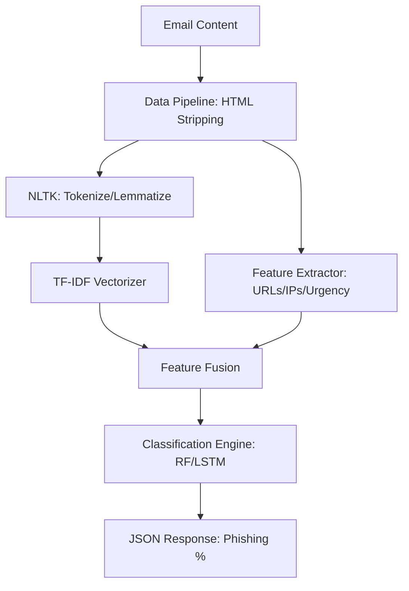

# System Architecture

The Phishing Email Detection Framework is designed with a **Modular Pipeline Architecture**. This allows each stage (Ingestion, Preprocessing, Extraction, and Modeling) to be updated or replaced independently.

---

## 1. Architectural Layers

### A. Ingestion Layer
- Responsible for handling different input formats (Text, HTML, JSON).
- Acts as the entry point for the FastAPI server.

### B. Transformation Layer (Preprocessing)
- A stateless layer that applies deterministic transformations (lowercase, stripping HTML).
- This ensures that data seen during training and data seen during production are identical in format.

### C. Feature Layer (Dual-Path)
- **Path 1 (NLP)**: Automated vectorization using TF-IDF or Word Embeddings.
- **Path 2 (Domain-Specific)**: Manual extraction of lexical and structural features (URL count, Urgency keywords).
- **Result**: A "Hybrid Feature Space" that combines deep semantic understanding with explicit security indicators.

### D. Modeling Layer
- **Baseline (Static)**: Random Forest model for fast, explainable results.
- **Advanced (Sequential)**: Bi-LSTM model for capturing long-term dependencies in sentence structure.

### E. Deployment Layer
- **API Wrapper**: FastAPI provides an asynchronous, high-performance interface.
- **Containerization**: Docker ensures the environment (Python version, NLTK datasets) is consistent across different machines.

---

## 2. Component Diagram (Logical)

