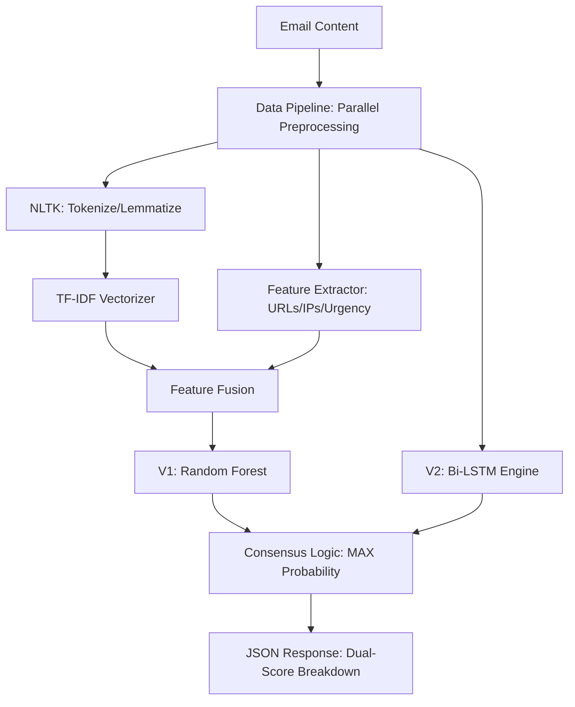

# System Architecture (v2.0 - Consensus Engine)

The Phishing Email Detection Framework has evolved from a single-model baseline to a **Dual-Inference Consensus Architecture**. This allows for higher precision by combining traditional statistical methods with deep learning.

---

## 1. Architectural Evolution

### Phase 1: The Baseline (Legacy)
Originally, the system relied solely on a **Random Forest** classifier fed by TF-IDF vectors and manual feature extraction. This provided high speed and interpretability but lacked deep semantic context.

### Phase 2: The Consensus Engine (Current)
We have now integrated a **Bi-LSTM (Bidirectional LSTM)** model. The system now operates on a **Consensus Logic**:
1. **Parallel Execution**: Both RF and Bi-LSTM process the input simultaneously.
2. **Probability Maxing**: The API takes the higher probability from both models to ensure no potential threat is missed (conservative security approach).

---

## 2. Architectural Layers

### A. Ingestion Layer
- Responsible for handling different input formats (Text, HTML, JSON).
- Acts as the entry point for the FastAPI server.

### B. Transformation Layer (Preprocessing)
- **Current Improvement**: Added **Parallel Preprocessing** using multiple CPU cores to handle bulk training and real-time inference without latency.
- A stateless layer that applies deterministic transformations (lowercase, stripping HTML).

### C. Feature Layer (Dual-Path)
- **Path 1 (NLP)**: Automated vectorization using TF-IDF or Word Embeddings.
- **Path 2 (Domain-Specific)**: Manual extraction of lexical and structural features (URL count, Urgency keywords).
- **Result**: A "Hybrid Feature Space" that combines deep semantic understanding with explicit security indicators.

### D. Modeling Layer
- **[V1] Baseline (Static)**: Random Forest model for fast, explainable results.
- **[V2] Advanced (Sequential)**: Bi-LSTM model for capturing long-term dependencies in sentence structure.

### E. Deployment Layer
- **API Wrapper**: FastAPI provides an asynchronous, high-performance interface.
- **Frontend**: A Glassmorphism Dashboard that visualizes the breakdown between V1 and V2 results.
- **Containerization**: Docker ensures the environment (Python version, NLTK datasets) is consistent.

---

## 3. Component Diagram (Evolved)

